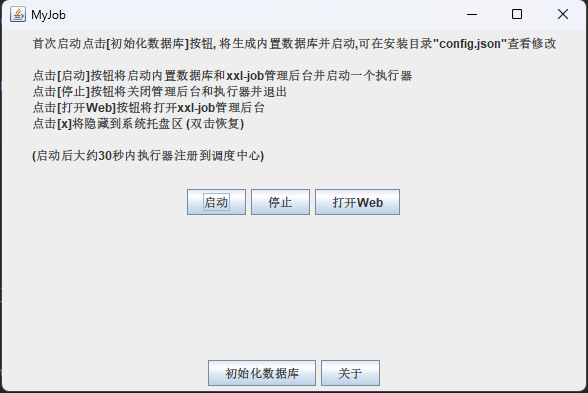

# xxl-job for windows
>基于 [XXL-JOB](https://github.com/xuxueli/xxl-job)

## 说明
- [原项目: XXL-JOB](https://github.com/xuxueli/xxl-job)
- 打包工具: Launch4j + Inno Setup 6
-
## 修改项
- 在xxl-job-admin里直接集成了`SampleXxlJob` 无需单独启动
- 支持 MariaDB4j, 无需独立的MySQL数据库
- 简化配置步骤

## 版本
- minimal版:
    - 自行安装jre环境
    - 自行部署MySQL数据库
    - 免安装下载即可运行
- All-in-One版:
    - 自带jre环境
    - 内置数据库
    - 一键启动

## 使用说明
#### 1. 下载安装
- minimal版: [MyJob.exe](https://github.com/ts7ming/xxl-job-win/releases)
- All-in-One版: [MyJob-Installer.exe](https://github.com/ts7ming/xxl-job-win/releases)

#### 2. 安装 (minimal版没有这个步骤)

#### 3. 启动
##### 主界面-minimal版

##### 主界面-All-in-One版

#### 4. 首次使用配置
- minimal版 修改 `config.json` 文件里数据库连接和账户
- All-in-One版首次启动会自动生成配置文件, 可以直接使用
- 点击 `初始化数据库` 按钮. 等待执行完成
    - All-in-One版会启动内置MariaDB并初始化库表. 可以通过数据库管理工具连接, 连接信息在`config.json`
    - minimal版会新建 `xxl_job` 数据库, 请确保账户有足够的权限

##### 5. 启动
- 点击 `启动` 按钮.
- 点击 `打开Web` 按钮 或 自行浏览器打开 [http://127.0.0.1:9001/xxl-job-admin](http://127.0.0.1:9001/xxl-job-admin)
- 初始账号: u:admin/p:123456

##### 6. Enjoy
- 用法和原 xxl-job一致